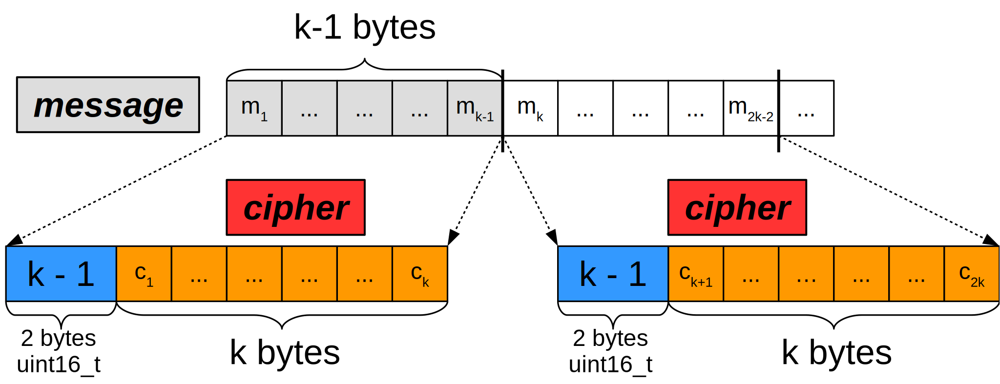
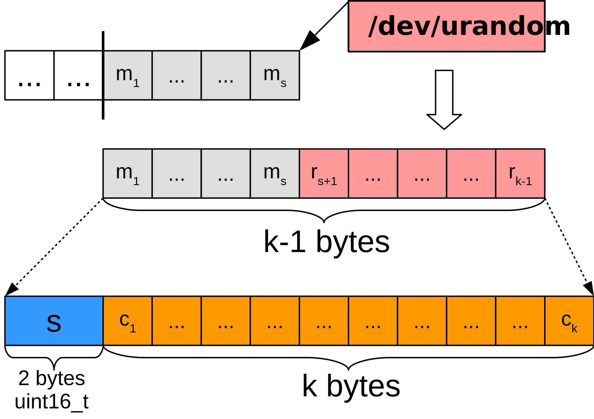

# rsa-simple
Simple RSA implementation in plain C using GMP library.

- - -

## Disclaimer

This is a project made for fun and coding practise. It is slow, bad-designed
and vulnerable. Do not use this program if you need a really strong 
encryption for your data. Try pro crypto systems instead (PGP is a good choice).

## Requirements

* GMP

    The GNU Multiple Precision Arithmetic Library is used in main
    RSA operations with long integers. You can download and compile
    the latest version from the [official website](https://gmplib.org)
    or you can try to download it from your OS repositories.

* POSIX environment

    I am too dumb to make portable programs (yet) so rsa-simple uses
    standard POSIX header `arpa/inet.h` for `htons/ntohs` declarations
    and random device `/dev/urandom` to generate randoms.

* standard C compiler/linker

## Usage

Compile and link the program. You can use Makefile in the main directory or compile it
by yourself. Three executables are generated: rsa-generate-key, rsa-encrypt, rsa-decrypt

* Key generation

    To generate a new RSA pair run

        $ ./rsa-generate-key key_size public_key private_key

    `key_size` is the key size (in bytes) you want to generate. `key_size` must be in range
    from 256 to 1024. Lower limit is set to 256 because keys with size less than 256 bytes
    (2048 bits) are considered weak. Higher limit is set to 1024 bytes due to perfomance issues.

    `public_key` and `private_key` are the paths to public and private key files.
    Be careful - existing files will be truncated (or created if not exist).

* Encryption

        $ ./rsa-encrypt public_key message_file encrypted_file

    `public_key` is the path to your key (messages are usually being encrypted using public RSA keys).

    `message_file` is the path to your message file, `encrypted_file` is the path to encrypted result.
    Be careful - `message_file` and `encrypted_file` must be different files, because
    `encrypted_file` is truncated first.

* Decryption

        $ ./rsa-decrypt private_key encrypted_file decrypted_file

    `private_key` is the path to your key (messages are usually being decrypted using
    private RSA keys).

    `encrypted_file` is the path to your encrypted message file,
    `decrypted_file` is the path to decrypted result.

    `encrypted_file` and `decrypted_file` must be different.
    `encrypted_file` must be encrypted using a public key corresponded to `private_key`.
    In other cases you will get a runtime error or the mess in `decrypted_file`.

## Description

You can read full RSA description on corresponding
[wiki page](https://en.wikipedia.org/wiki/RSA_\(cryptosystem\)).

Input message is divided into blocks of k - 1 bytes where k is the size
of the RSA key (byte size of RSA modulus N = pq). Each block is treated
as a k-1 length bigendian number M in 256-based numeral system.
It is transformed to C = M ^ e mod N (e is the exponent of the key)
and is written to the output with the size of the block k - 1 (2 bytes bigendian).

In the special case of the last block (which could be shorter than
k - 1 bytes) the /dev/urandom device is used to generate the message tail.
That randomness enforces last block from brute-force decryption especially
if the last block is short (less than 10 bytes). The size of the true data
is written in last block (not the block size).

Decryption process is the same. 2 bytes bigendian block size is used to
get rid of random tail in the last block.
